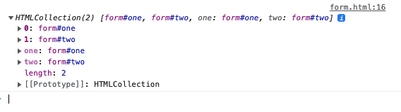

# why-do-we-need-to-wrap-our-web-form-in-a-form-element

Wrapping `<input/> ` in `<form/>` element register the form in DOM, which you can access with `document.forms`:


```html
<!DOCTYPE html>
<html lang="en">
<head>
  <meta charset="UTF-8">
  <title></title>
</head>
<body>
 <form id="one">
   <input>
 </form>
 <form id="two">
   <input>
 </form>
 <one></one>
 <script>
   console.log('fdsadf')
 </script>
</body>
</html>
```

 

