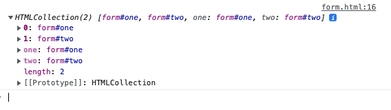

## Why do we need to use form element?

1. it is semantically correct.
2. it let you defined action and method attributes.
3. form are registered in the dom.


### Form are registered in DOM (point 3 above)

`<form/>` element register the form in DOM, which you can access with `document.forms`:

```html
<!DOCTYPE html>
<html lang="en">
<head>
  <meta charset="UTF-8">
  <title></title>
</head>
<body>
 <form id="one">
   <input>
 </form>
 <form id="two">
   <input>
 </form>
 <one></one>
 <script>
      console.log(document.forms)
 </script>
</body>
</html>
```

 




## live server

We use live server instead of dragging the html file direct into the browser because the file protocal does not support ajax.


